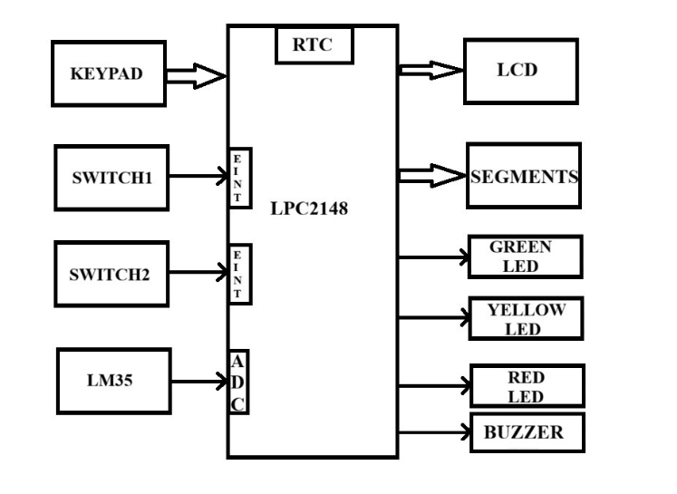

# Smart Exam Hall Monitoring and Management System

An ARM7-based embedded system built with the **LPC2148** to automate examination timing, monitor room temperature, provide visual status indication, and handle examination interruptions.

## Overview

The **Smart Exam Hall Monitoring and Management System** integrates several LPC2148 peripherals into one embedded application. It provides real-time examination timing, temperature monitoring, a countdown display, pause/resume control, and an examination-completion indication.

This project was developed as a practical application for understanding and implementing LPC2148 peripherals.

## System Block Diagram

The diagram below shows the keypad, switches, and LM35 sensor connected to the LPC2148, along with the display, LEDs, and buzzer driven by the controller.



## Features

- Real-time date and time display using the **RTC**
- Examination-duration configuration using a **4×4 matrix keypad**
- Examination countdown timer
- Remaining examination time on two multiplexed 7-segment displays
- Room-temperature monitoring using the **LM35** and **ADC**
- Temperature display on the **16×2 LCD**
- Three-level examination-status indication:
  - Green LED — more than 70% of examination time remaining
  - Yellow LED — between 30% and 70% remaining
  - Red LED — 30% or less remaining
- **Pause/Resume** functionality using an external interrupt
- Automatic recording of examination start and end times
- Buzzer indication when the examination reaches zero
- LCD-based status and configuration interface

## Hardware Used

- LPC2148 ARM7TDMI microcontroller
- 16×2 LCD
- 4×4 matrix keypad
- LM35 temperature sensor
- 10-bit ADC
- RTC
- Two 7-segment displays
- Green, yellow, and red LEDs
- Buzzer
- Push switches
- USB-UART / DB-9 interface

## LPC2148 Peripherals Used

- **GPIO**
- **RTC**
- **ADC**
- **External Interrupts (EINT0/EINT1)**
- **VIC (Vectored Interrupt Controller)**
- LCD interfacing
- Keypad interfacing
- Timer/delay functions
- 7-segment multiplexing

## System Operation

### 1. Normal Operation

After power-up, the LCD displays the current RTC time and room temperature.

```text
Time: 12:30:45
Temp: 28°C
```

The LM35 produces an analog voltage proportional to temperature. The LPC2148 ADC converts this voltage into a digital value, which is then converted into a temperature reading.

### 2. Examination Configuration

The administrator enters configuration mode using the keypad and can configure the following:

- RTC date and time
- Examination start time
- Examination duration

### 3. Examination Start

When the configured examination time is reached, the system:

- Records the examination start time using the RTC.
- Starts the examination countdown.
- Displays the remaining time on the multiplexed 7-segment displays.
- Updates the LED status according to the remaining time.

### 4. Countdown Indication

The two 7-segment displays show the remaining examination time in minutes:

```text
30 → 29 → 28 → ... → 02 → 01 → 00
```

The displays are multiplexed using shared segment lines.

### 5. LED Status

The LEDs provide a quick visual indication of the remaining examination time.

| Remaining time | Indication |
| --- | --- |
| More than 70% of examination duration | Green LED |
| More than 30% and up to 70% | Yellow LED |
| 30% or less | Red LED |
| 00 minutes | Buzzer |

### 6. Pause / Resume

An external interrupt provides pause/resume functionality:

```text
Running → Paused → Running
```

The countdown resumes from the remaining time.

### 7. Examination Completion

When the countdown reaches `00`, the system activates the buzzer, marks the examination as complete, records the end time using the RTC, and displays the relevant information on the LCD.

## Application

This project demonstrates how multiple microcontroller peripherals can be integrated into an examination-management application for automated timing, environmental monitoring, status indication, and interruption handling.

> **Note:** This project was developed as a practical LPC2148 peripheral-integration exercise, with the objective of understanding and implementing the individual hardware peripherals through a single application.

## Author

**Pravin Patil**

Embedded Systems / ARM7 Project
